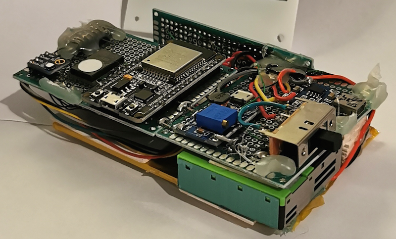

# IAQLogger

An Indoor Air Quality monitor I built for a client who wanted to display the capabilities of their filters in a fair exposition cabinet.

The device sports an ESP32, a SPS30 particulate matter sensor, an iAQ-Core CO2 and TVOC sensor, and an eInk Display for coolness.

One of the requirements was also to expose both live and histyorical data through an API to drive a WEB frontend (not part of this project).

## Hardware

The assembled contraption, with a generous dose of hot glue to add extra sturdiness during trasportation (I know, I know, it's not production ready). At the bottom you can barely see the large (2500 mAh) battery that ensures at least a full day at the fair with WiFi and all sensors enabled.



The temporary nature of the hand-wiring and hot glueing is hidden in a 3D-Printed enclosure.


## API

The `/info` endpoint returns current live data from the device.

````
GET 'http://iaqm.local/info'

{
    "ip": "192.168.8.134",
    "disk": {
        "used": "411389",
        "total": "1378241"
    },
    "battery": {
        "level": "73",
        "voltage": "3.88"
    },
    "iaq": {
        "temperature": "26.0",
        "humidity": "58",
        "co2": "-9999",
        "tvoc": "-9999",
        "pm1": "7",
        "pm2p5": "9",
        "pm4": "10",
        "pm10": "10"
    }
}
````

The `/logs/{n-days}` endpoint allows to fetch a CSV data log {n-days} in the past

````
GET 'http://192.168.8.134/log/0'

TIME,T,H,CO2,TVOC,PM1,PM2.5,PM4,PM10
2022-03-15T00:00,22.4,35,3620,998,2,2,2,3,4118
2022-03-15T00:01,22.5,37,3675,1013,4,5,5,5,4132
2022-03-15T00:02,22.7,36,3690,1018,4,5,5,5,4138
...
````


